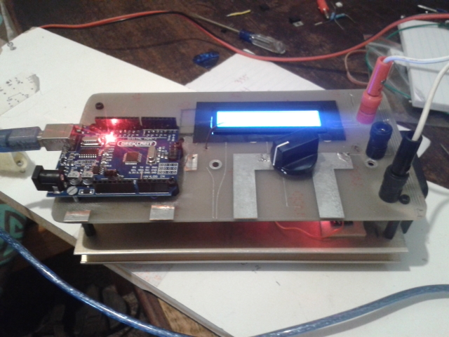
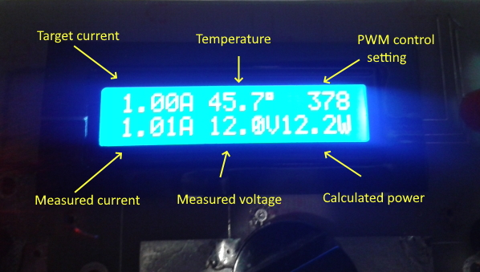
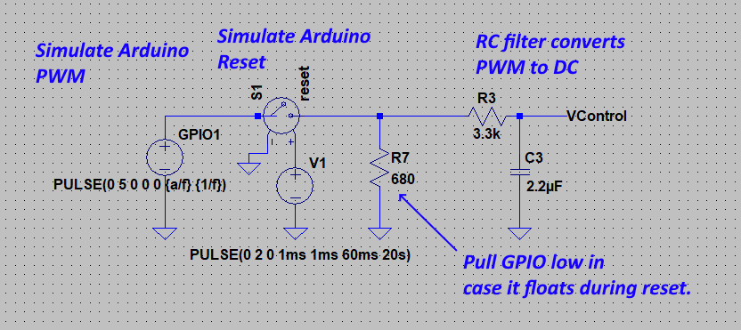
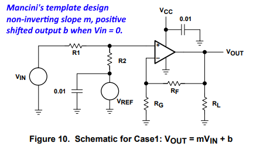
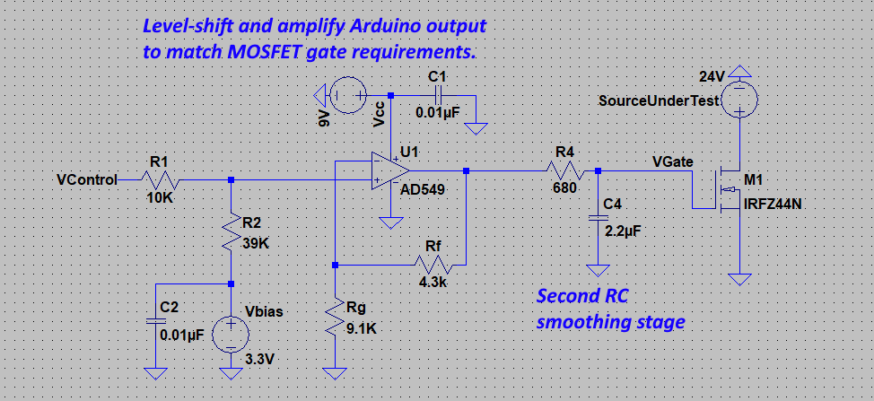
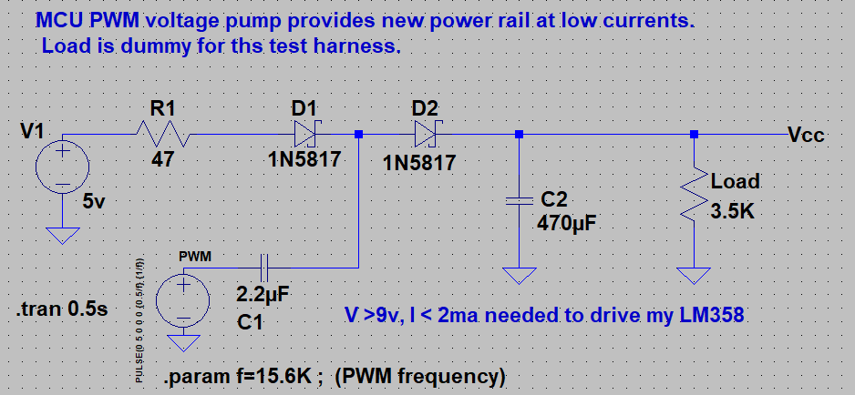
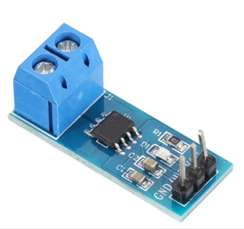
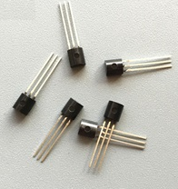
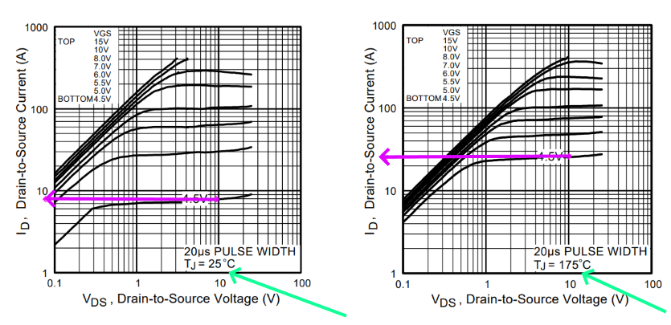
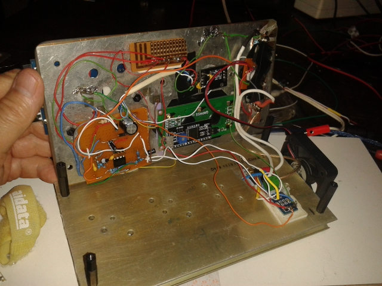

# Arduino Constant-Load Retro-Look DIY Project

*_An Arduino UNO provides control for fixed current or fixed power loads._*

_Pete Wentworth_    mailto:cspwcspw@gmail.com  

## Overview

There are plenty of DIY constant power / constant load projects. 
Building one is almost a "rite of passage" if we're going
to stress-test power supplies, solar panels, batteries, etc. 

[This one from GreatScott!](https://www.youtube.com/watch?v=VwCHtwskzLA) put me
on the lookout for a decent heat sink, so I snapped an old driver board when 
I found one scheduled for recycling.   

The heatsink indirectly determined the final look of the build.
Instead of finding a project box I re-used the PCB that was originally 
under the heatsink.  I mounted it on standoff stilts to make a front 
panel for the project. After cutting a hole in the PCB for the LCD screen 
and mounting some banana-plug connectors, I asked "Why not mount the Arduino 
on top, instead of inside?"   Then I found an old-fashioned knob for the
rotary encoder, etc. etc.  So the final product looks like this:

Having the Arduino on the outside rather than the inside has been useful: 
I can download other sketches and I already have hardware like
the LCD, rotary encoder, temperature and current sensors, etc. all hooked up.
And all the headers are still available for breadboard use. 

Here's a close-up of the LCD with the controller drawing a load from my 
bench power supply.  The temperature measured at the MOSFET is in Celcius.  

While this project unfolded I was part of a stay-at-home lockdown 
from the COVID-19 pandemic. 
That ought to be irrelevant, but I was unable to get online
deliveries, so it had to be "make some plan with whatever 
you happen to have available". 
And it became a playground for scope creep and extra features that make the final
product a somewhat over-engineered hodge-podge of complexity. 

So if you want something relatively straightforward, stick with Great Scott.  

## Overview

The basic parts of the circuit are the power stage, the gate drive stage, measuring 
the current flow and the voltage of the source, and
the back-end control logic on the Arduino.  I've included back-end code, and most 
of the circuitry as an LTSpice simulation. 

## The output power drive circuit

The basic idea is to use a beefy MOSFET and a large heat sink. MOSFETs
are generally popular because they have very low resistance when they're 
fully turned on, meaning they can control a lot of current through an
external load like a motor or a transformer in a switched power supply.  

The IRF3205 I used is rated for 75 Amps continuous current at 55V, provided
we can keep it cool.  But its Rds(ON) - resistance when fully on - 
is only 8 milliOhms. So power dissipation is quite modest with such 
low resistance.  That only applies if we keep the 
MOSFET fully on. Many data sheet ratings are for short-duration 
pulses, such as you'll find in high-frequency switched power supplies.

However, in this project we're using the MOSFET to directly load the
source.  So if I want to test a 12V battery at 2 Amps I need to turn the 
MOSFET only partially on, and leave it conducting continuously,
so that its RDS is about 6 ohms. That 
creates 24 watts of heat - a small soldering iron's worth - which needs  
to be dissipated.  

Unfortunately, the IFR3205 is not a "logic level MOSFET".  (Neither was the
IRFZ44N that GreatScott used.)  This means that the controlling gate 
requires control voltages outside "logic levels" provided by the Arduino.
For example, to start any
current flow in the MOSFET (the so-called Gate Threshold Voltage) I need
between 2V to 4V on the IFR3205 data sheet, and to fully turn on
the device needs about 8V on the gate.  (I'm never going close to 
fully turning on the MOSFET, so I get away with a bit less than 8V.)

So how are we going to get the Arduino to generate and control 
a variable analog voltage in the range of about 2V-8V to drive the 
MOSFET gate? 
 
## Generate your analogue voltages from PWM on the Arduino

Let's begin by generating voltages in the range 0V to 5V from the
Arduino.  A common trick is to use PWM pulses and a low-pass 
filter to smooth the square pulse.  The Arduino can vary the PWM
duty time, and effectively set an analogue output voltage. See, for example
https://www.instructables.com/id/Analog-Output-Convert-PWM-to-Voltage/ 

One needs some quite aggressive smoothing.  For example,
Great Scott first amplified his square PWM wave and gave it a 
lot more drive current with a 4420 MOSFET driver.  He then used an
RC smoothing circuit with a 10 Ohm resistor and a 470uF capacitor 
to create the voltage for the MOSFET gate.  

Normal PWM on the Arduino has only 8 bits of resolution, and a fairly
slow PWM carrier frequency.  The faster the PWM frequency, the easier 
it is to clean up the output. And I'd like finer PWM resolution.  

https://arduino.stackexchange.com/questions/12718/increase-pwm-bit-resolution/12719 
shows us how to use the 16-bit timer 1 on the Arduino to create higher 
resolution PWM outputs.  There is a tradeoff: for each extra bit of 
resolution, the counter has to count twice as far, so the frequency of the PWM
halves.  I chose 10-bit PWM output which gives a PWM carrier frequency of 
about 15.6Khz.   

So here is the intial LTSpice simulation and the "front end" of my
build.  I used a switch in LTSpice to "float" the GPIO - this simulates
what happens when the Arduino is reset.

Smoothing was still a bit problematic. With bigger resistors and capacitors 
in the RC circuit I got less ripple, but slower response to changes in the
PWM value.  And I still had to solve the problem of level shifing and 
remapping the 0V-5V into 2V-8V.   

To shift and stretch the voltage range I used an OpAmp.  And I wanted a 
two-pole smoothing filter.  What seems to work really nicely is that I put a smaller 
resistor and capacitor ahead of the opAmp (so I have a DC voltage as input to 
the amplification stage, but still with 
some ripple).  After amplification and shifting I put the second filter
pole to clean up remaining ripple. 

## A Detour into OpAmps 101

I had a couple of choices in my available parts: I chose the
ubiquitous LM358P.  

In an ideal world, every opAmp has a straight line response:  you
put in `X` and get out `Y = mX + b`.  The slope of the line, `m`, can be
positive or negative, and represents the gain.  `b` represents the 
offset.  `X` here is going to be the 0V-5V analogue value from the 
smoothed PWM from the Arduino. Y (still with some ripple) will
be smoothed and fed into the MOSFET gate, where I want, say, 2V-8V.

OpAmps usually need both positive and negative voltage rail supplies.
But having to provide extra voltage rails for the opAmp is a 
pain.  So there are some designs for "single-ended" circuits that
operate the device with its lower supply rail at ground.  This is much
trickier territory.   

Ron Mancini from Texas Instruments provided my go-to resource for
single-ended opAmp design at http://www.ti.com/lit/an/sloa030a/sloa030a.pdf 
After some wading through the theory he comes up with four possible cases, 
and then provides a suggested template circuit
for each.  The case I needed was a non-inverting amplifier where
my offset `b` would be about 1.8V: just below the MOSFET gate threshold. 
This is Mancini's cookbook design that I adapted:  

The gain, or `m` in the equation, is (`1 + Rf / Rg`), so 
that could be a trimpot or 
a sensitivity potentiometer in my final circuit.  
 
The other big "gotcha" about OpAmps, though, is how close the output
can get to the power rails.  Newer OpAmps specifically designed for
single-ended supplies are often "rail-to-rail" meaning that the 
input or output voltages can very closely approach the supply rail voltages. 
(Some opAmps can only get close to the rails on outputs, some only on inputs.
Some, usually marketed as RRIO, can get close to the rails on both
inputs or outputs.)  
 
My LM358p remains responsive when its input voltage is pretty close to the 
zero rail, but the response curve was only linear for outputs 
between 0.7V and about Vcc-1V.  

So here is the LTSpice "back end" of my circuit. To make it easier for
others to run my simulation, I substituted built-in, but a "similar enough"
opAmp (AD549) and MOSFET (IFRZ44N) components into the simulation.

The output of this amplifier stage will feed the MOSFET gate. 
The 0.7V will is low enough to turn off the MOSFET completely. 
So all I need now is a rail voltage of at least 9V to get 
my OpAmp output up to 8V.

But I really didn't want to have to bring in another power rail ...

 ## A Voltage Multiplier to the Rescue 

A Dixon voltage multiplier comprises two diodes and two capacitors. One diode 
provide a base supply voltage (5V in this case) and the Arduino PWM output, 
through a capacitor, periodically "pumps" additional voltage into the output. 
Some smoothing is added to this.  See
https://en.wikipedia.org/wiki/Voltage_doubler 
or watch https://www.youtube.com/watch?v=I4ED_8cuVTU.

This arrangement is ideal for generating a higher voltage for low-current 
requirements: a very good fit in my project.
All I need is to provide a high-voltage rail for the opAmp, 
which in turn sources the current to drive the MOSFET gate. 
The MOSFET is a voltage-controlled device - its current requirements 
on the Gate are extremely low unless the design needs to overcome 
the high gate capacitance in a hurry for high-frequency switching. 
High-frequency MOSFET switching is absolutely not a requirement here. 
Again I used different Schottky diodes in my build, but the ones
shown here are similar enough, and in the LTSpice component library. 

The two-pole smoothing mentioned previously fits quite nicely too. 
Any ripple remaining on the rail voltage will
appear on the opAmp output. But so will any ripple from the PWM 
to voltage low-pass filter which is being amplified.  So the RC filter 
sitting behind the opAmp helps with both these cases. 

## Measuring the Current

GreatScott! used a 20A hall-effect current sensor to sense 
current.  They come in different ratings (and sensitivies). I now have some 
capable of 5A, 20A, 30A and even one that can supposedly
measure up to 50A.

I'm using a 30A INA712-based sensor, which costs less than $3. 
But readings are very noisy at low currents. So there is
considerable averaging and further historical smoothing that takes place in the
software. 

I doubt my over-ambitious build will ever get close to 30 Amps of power, so if
I were to start again I would probably target lower total power draw in the hope 
of getting better current meaurements in a smaller range. 

## Temperature Measurement

It would be nice to monitor the temperature of the MOSFET.  I had some
cheap little temperature sensors, I mounted one on top of the MOSFET
and added some software control for thermal overload cutoff, 
and for switching a fan on or off.

Reading the sensors in the background (I was unwilling to suspend my
measure-and-control cycle for the duration needed to read the sensors with
the standard libraries) became a major diversion from the main project. 
So much so that I wrote it up separately, available 
at https://github.com/cspwcspw/Background_DS1820_Sensing 

The take-away here is that plastic-encased "environmental" sensors have slow
thermal response and are not really suitable for protection 
in the same way that a fast-blow fuse might provide protection. But these cost 
less than half a dollar, and provided plenty of DIY challenges and fun watching
the fan turn on and off at the programmed thresholds.

But apart from that, I learned an interesting lesson.  I have a software
mode that allows setting the PWM level (and thus the MOSFET gate voltage)
manually, rather than under automatic feedback control of the Arduino.  If I
keep the MOSFET gate voltage constant, it turns out the MOSFET is very 
susceptible to thermal runaway.  As the MOSFET
gets hotter, it allows more current to flow, and thus has to dissipate more
heat, making it even hotter ...    

This is consistent with the IRF3205 data sheet. 
At a fixed 4.5V gate voltage
controlling a 10 Volt load, the current is around 8 amps at room temperature, 
but for that same gate and load voltages, the current climbs to 26 amps if the 
junction gets really hot.  (These are short 20us pulses).

## Parasitic Cooling and Shunt Loads

A spare 12V computer fan was wired in parallel across the MOSFET,
via a 7812 regulator, and a TIP120 transistor.  The fan can be turned on or off
from the Arduino with an GPIO line through a resistor to the base of the TIP120. 
Importantly, I route the emitter of the transistor back into the current being
measured by the INA712, so when the fan turns on or off the
system recognizes that as extra load drawn from the battery, and adjusts the
MOSFET gate voltage to keep tracking the target load. 
Of course, when my source voltage is too low the fan won't run. 

Along this line of thinking I have provided a "shunt connector" on the front
panel of the build to bypass the MOSFET, but so that I still measure and 
take account of the shunted current. So I can burn up energy from the battery 
in my shunt circuitry.  

## Some notes about the software

Besides the very convoluted temperature measurement described
at https://github.com/cspwcspw/Background_DS1820_Sensing 
I did a few other interesting things.

Rather than use interrupts to handle the quadrature encoding on the rotary 
encoder, I preferred a regularly polled solution.  My interrupts were noisy 
and multi-triggering.  To rig up regular polling I have set an interrupt
trigger register on hardware timer 1.  That timer is already used in the 
Arduino for upating the `millis()` counter. The article 
at https://learn.adafruit.com/multi-tasking-the-arduino-part-2/timers 
shows how to piggy-back your own interrupt onto that counter.  From that
call I can poll the two lines of the rotary encoder and track direction
of movement, and estimate speed of rotation. 

At one stage I considered logging data and looked like I might run out of
memory. So I moved all the constant strings in the program into a String 
Store object.  In principle this would let me put the strings in some
external flash.  I never had to take that step, and finally ended up with only 
about 62% of the Arduino's dynamic memory used - plenty of spare room!    

There is a string-based menu picking system that allows the user to pick
items using the rotary encoder with feedback on the LCD.

And for the LCD display I extended the `LiquidCrystal_I2C` library with
some new functionality. I define zones on the LCD, and can target output
into a specific zone.  The zone can be left or right aligned.  
I then also added some functions to show strings,
integers, or double values in the targeted zones.  

## Resources

Under the hood is not very pretty.  But it works.

TThe source code and some LTSpice simulation source files are on Github.

*Last Revision 16 April 2020*  
mailto:cspwcspw@gmail.com 
